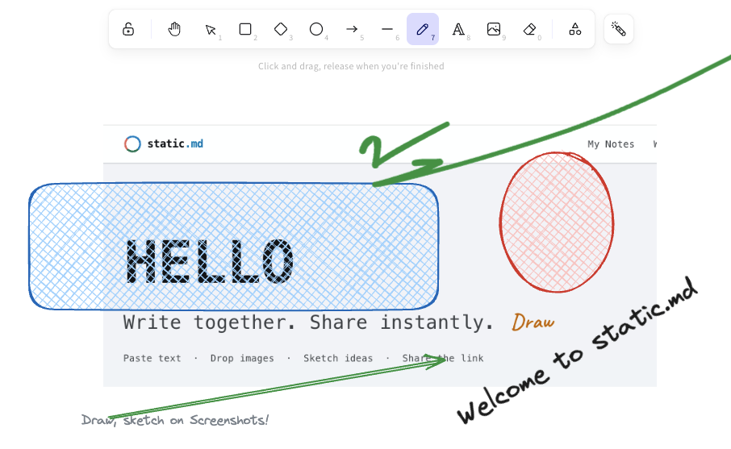

# StaticShot

> Capture, annotate, and save screenshots as markdown notes or images on [static.md](https://static.md).



## What it does

- Grabs the visible viewport of any tab.
- Drops it onto a canvas for cropping and annotation.
- Uploads to static.md and returns a shareable URL — image or collaborative note.

## Features

### `~/capture`

```
$ shot     — capture the visible viewport
$ crop     — drag a region, release to confirm
$ full     — click or Space to keep the whole viewport
$ cancel   — Esc to abort at any time
```

### `~/annotate`

```
$ draw     — freehand, shapes, arrows, lines, text
$ style    — sloppiness, roughness, hachure fills
$ edit     — per-element properties panel
$ undo     — full history, keyboard shortcuts
```

### `~/share`

```
$ upload   — push to static.md, copy the gallery URL
$ note     — save as a collaborative markdown note embedding the shot
$ open     — jumps straight to the result in a new tab
```

### Works with static.md

Fits into the wider [static.md](https://static.md) ecosystem — collaborative notes, free image hosting, shared whiteboards. One link to share, no account required.

## Install

From the Chrome Web Store:

  https://chromewebstore.google.com/detail/staticshot-screenshot-cap/bbgoenllpdnfljjapjcababahphohncj

Or load unpacked:

```bash
npm install
npm run build
# then in Chrome: chrome://extensions → Developer mode → Load unpacked → select dist/
```

## Develop

```bash
npm install
npm run dev          # Vite dev with HMR — load dist/ as unpacked
npm run build        # production build → dist/
npm run zip          # packages dist/ into a Chrome Web Store upload
```

Reload the extension from `chrome://extensions` after changing `manifest.ts` or the background worker. Content-script and editor changes hot-reload through Vite.

## Architecture

MV3 service worker captures the tab via `chrome.tabs.captureVisibleTab`. A content script overlays the page with a crop selector (drag, Click/Space for full viewport, Esc to cancel). The cropped `dataURL` is handed off to a new tab with our editor wrapped. On save, the editor exports a PNG and uploads to static.md, returning a shareable URL.

## Tech

- Vite + `@crxjs/vite-plugin`
- TypeScript
- React 19
- `@excalidraw/excalidraw` 0.18
- `spark-md5` for client-side content hashing

## License

[SEE LICENSE](./LICENSE)
